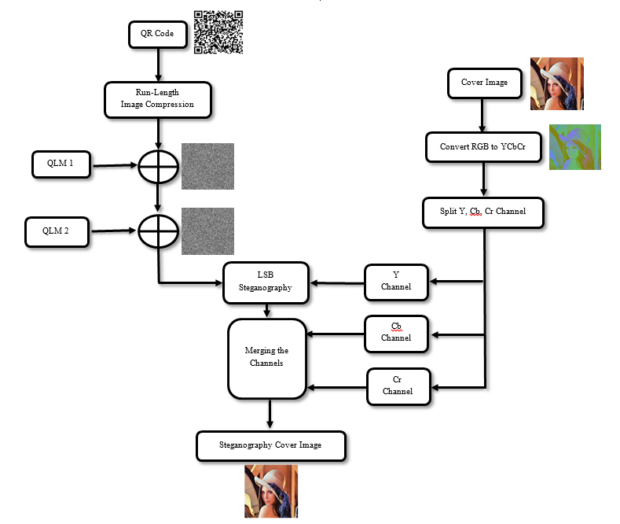
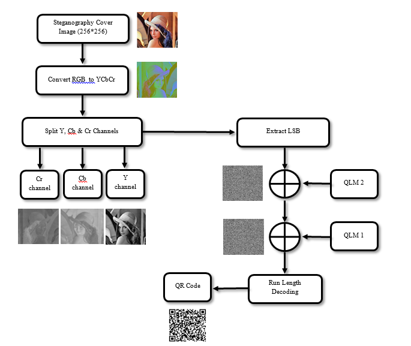

# 🔑 Image_Dataset_Ycbcr_Lsb

**Image_Dataset_Ycbcr_Lsb** is the core algorithm and benchmark dataset repository behind **CampusKey** — a digital identity verification system that embeds invisible QR codes into images using **LSB steganography in the YCbCr color space**, secured with **5D Quantum Logistic Map (QLM) chaotic encryption**.

This repository isolates the underlying **embedding/extraction algorithm** and provides a **structured dataset of cover images, watermarked images, and attacked (post-processing) images at multiple resolutions**, used to evaluate the algorithm's robustness for our research paper.

## 🧠 Overview

This repository supports empirical evaluation of a multi-layer image watermarking scheme:

- **Invisible QR embedding** via LSB steganography in the Y (luma) channel of YCbCr color space
- **Chaotic encryption** of the QR payload using a 5D Quantum Logistic Map, applied in two cascaded stages with XOR diffusion
- **Compression** of the QR bitstream via Run-Length Encoding (RLE) prior to encryption, to reduce payload size
- **Robustness benchmarking** of the watermark against common image-processing attacks, across four image resolutions (256×256, 512×512, 1024×1024, 2048×2048)

## 🔧 Technologies Used

| Technology | Purpose |
|---|---|
| Python | Core programming language |
| OpenCV | Image manipulation & QR scanning |
| Pillow | Image I/O and resizing operations |
| NumPy, SciPy | Numerical processing and chaotic map computation |
| QR Code Libraries | QR code generation & decoding |
| Git | Version control |

## 🗂️ Repository Structure

```bash
Image_Dataset_Ycbcr_Lsb/
├── CodeFiles/                     # Core algorithm implementation
│   ├── FQLM1.py                    # First-stage 5D Quantum Logistic Map generator
│   ├── FQLM2.py                    # Second-stage 5D Quantum Logistic Map generator
│   ├── XOR1.py                     # XOR diffusion using FQLM1 keystream
│   ├── XOR2.py                     # XOR diffusion using FQLM2 keystream
│   ├── Frleencode.py               # Run-Length Encoding of the QR bitstream
│   ├── Frledecode.py               # Run-Length Decoding of the extracted bitstream
│   ├── FYCBCREnc.py                # Embeds encrypted payload into Y channel (YCbCr)
│   ├── FYCBCRDec.py                # Extracts payload from Y channel (YCbCr)
│   ├── cover_image.png             # Sample cover image
│   ├── qr code.jpg                 # Sample QR code to be embedded
│   ├── encryption_flow.png         # Flowchart of the encryption pipeline
│   └── decryption_flow.png         # Flowchart of the decryption pipeline
│
├── Image_Dataset_Ycbcr_Lsb_256x256/     # Benchmark dataset at 256×256
├── Image_Dataset_Ycbcr_Lsb_512x512/     # Benchmark dataset at 512×512
├── Image_Dataset_Ycbcr_Lsb_1024x1024/   # Benchmark dataset at 1024×1024
├── Image_Dataset_Ycbcr_Lsb_2048x2048/   # Benchmark dataset at 2048×2048
│
└── README.md
```

Each `Image_Dataset_Ycbcr_Lsb_<size>` folder shares the same internal layout:

```bash
Image_Dataset_Ycbcr_Lsb_<size>/
├── coverImage/                # Original, unmodified cover images
├── watermarked_image/         # Stego images after QR embedding
│
├── Salt&Pepper10/             # Watermarked images after Salt & Pepper noise (10% density)
├── Salt&Pepper25/             # Watermarked images after Salt & Pepper noise (25% density)
├── Salt&Pepper50/             # Watermarked images after Salt & Pepper noise (50% density)
│
├── gauss10/                   # Watermarked images after Gaussian noise (σ = 10)
├── gauss25/                   # Watermarked images after Gaussian noise (σ = 25)
│
├── poisson10/                 # Watermarked images after Poisson noise (level 10)
├── poisson25/                 # Watermarked images after Poisson noise (level 25)
├── poisson50/                 # Watermarked images after Poisson noise (level 50)
│
├── flip/                      # Watermarked images after horizontal flip
├── flipV/                     # Watermarked images after vertical flip
├── geometric90clock/          # Watermarked images rotated 90° clockwise
├── geometric90anticlock/      # Watermarked images rotated 90° anti-clockwise
└── geometric180/              # Watermarked images rotated 180°
```

File names follow the convention `(WxH)imageNNN.png`, e.g. `(1024x1024)image107.png`.

## 📌 How It Works

### 🔐 Embedding Flow
1. Generate a unique QR code from the target ID/payload.
2. Convert the QR to binary and compress it using Run-Length Encoding.
3. Encrypt the compressed bitstream with a two-stage 5D Quantum Logistic Map + XOR diffusion.
4. Convert the cover image to YCbCr and embed the encrypted bits into the LSBs of the Y channel.
5. Reconstruct and save the watermarked (stego) image → `watermarked_image/`.

### 🔓 Extraction Flow
1. Convert the (possibly attacked) stego image to YCbCr.
2. Extract the LSBs from the Y channel.
3. Reverse the two-stage XOR + 5D QLM encryption.
4. Run-Length Decode the recovered bitstream.
5. Reconstruct the QR code, scan it, and verify against the original payload.

### 🧪 Robustness Testing Flow
1. Take each image in `watermarked_image/`.
2. Apply a specific attack (noise injection, flip, or rotation) at a specific strength.
3. Store the attacked image in the corresponding folder (e.g., `gauss25/`, `flip/`).
4. Run the extraction flow on the attacked image and compare the recovered QR against the ground truth — repeated across all four resolutions.

## 📊 Evaluation Metrics

This dataset is intended to support computation of standard watermarking evaluation metrics, including:

- **PSNR** (Peak Signal-to-Noise Ratio) — imperceptibility of the watermark
- **SSIM** (Structural Similarity Index) — perceptual quality of cover vs. watermarked image
- **NCC** (Normalized Cross-Correlation) — similarity between embedded and extracted QR
- **BER** (Bit Error Rate) — robustness of the extracted payload after each attack

### 🔐 Encryption Flow

```bash
[qr code.jpg]
    ↓
[Frleencode.py] → Run-Length Encoding of QR binary
    ↓
[FQLM1.py] + [XOR1.py] → First layer of chaotic encryption
    ↓
[FQLM2.py] + [XOR2.py] → Second layer of chaotic encryption
    ↓
[FYCBCREnc.py] → Embed into Y channel using LSB in cover_image.png

```

### 🔓 Decryption Flow

```bash
[Stego Image]
    ↓
[FYCBCRDec.py] → Extract LSBs from Y channel
    ↓
[XOR2.py] + [FQLM2.py] → Reverse second XOR
    ↓
[XOR1.py] + [FQLM1.py] → Reverse first XOR
    ↓
[Frledecode.py] → Run-Length Decode
    ↓
[Reconstruct QR] → Scan and verify


```

## 📊 Flowchart Diagrams

### Encryption Flow


### Decryption Flow


## 🛠️ Installation & Setup

```bash
# Clone the repository
git clone https://github.com/Samyakjain2004/Image_Dataset_Ycbcr_Lsb.git
cd Image_Dataset_Ycbcr_Lsb

# Install dependencies
pip install -r requirements.txt
```

Dependencies include:
- opencv-python
- pyzbar
- pillow
- numpy
- scipy

## 📄 Related Work / Citation

This dataset and algorithm implementation accompany our research paper on QR-code-based digital identity watermarking using YCbCr-domain LSB steganography and 5D chaotic encryption. If you use this dataset or code in your work, please cite:

*(Citation details to be updated upon publication.)*

## 🌱 Future Scope
- 🔍 AI-based tamper detection
- 🔗 Blockchain-based ID verification
- 📱 Cross-platform mobile app
- 🧠 Biometric fusion (face/fingerprint)
- 🚪 IoT integration for access control

## 📜 License

This project is licensed under the MIT License.


Pull requests and suggestions are welcome! For major changes, please open an issue first to discuss.
